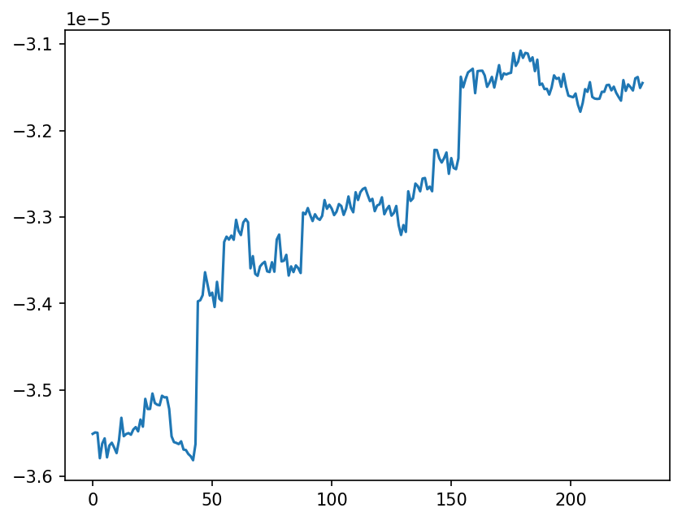
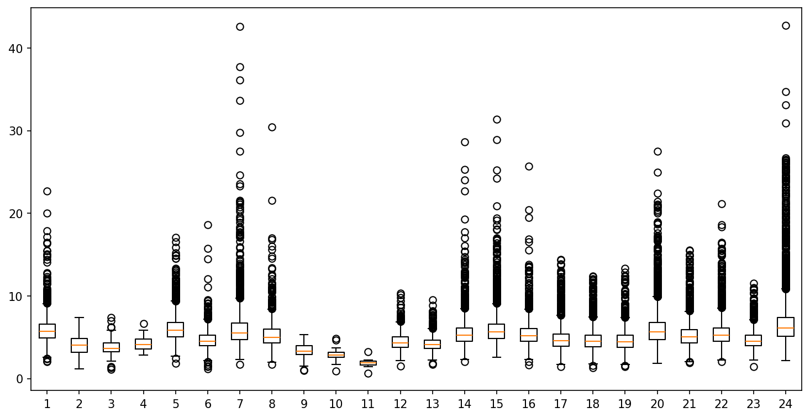

# `attribution_analysis`

**Implementation**: [View code documentation](../code/attributions_analyze.md)


**Command**
```bash
python -m src.torch.vit.attributions_analyze --output-dir plots/attributions
```

**Dependencies**
- `src/torch/vit/attributions_analyze.py`
- `src/torch/vit/class_wise_distribution.py`
- `src/torch/vit/ig.py`
- `src/torch/vit/train.py`
- `src/torch/vit/utils.py`
- `aarp_ml/torch/model.py`
- `aarp_ml/torch/dataset.py`
- `aarp_ml/dataset.py`
- `aarp_ml/torch/trained_model.py`
- `solar_dataset.json`
- `outputs/glad-shape-197/trained_model.pth`
- `stats.pkl`

**Outputs**
- `plots/attributions` _(directory — one subdirectory per AARP ID)_

## Output

### Attributions Percentiles


### Filtered Intensities



## Notes

_Add your notes about this stage here._
