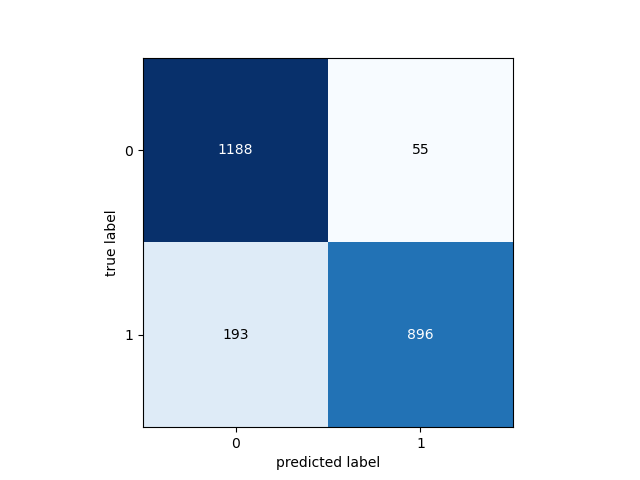

# `confusion-matrix-val`

**Implementation**: [View code documentation](../code/test.md)


**Command**
```bash
python -m src.torch.vit.test --subset validation
```

**Dependencies**
- `outputs/glad-shape-197/trained_model.pth`
- `solar_dataset.json`
- `src/torch/vit/test.py`
- `stats.pkl`

**Outputs**
- `plots/cm.png`

## Output

### Confusion Matrix


## Notes

_Add your notes about this stage here._

