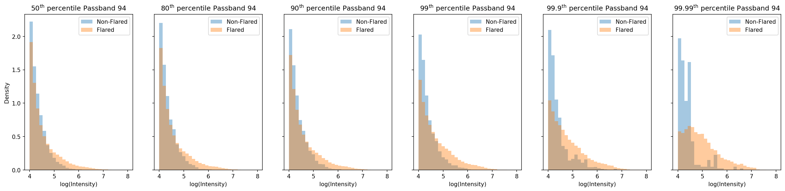
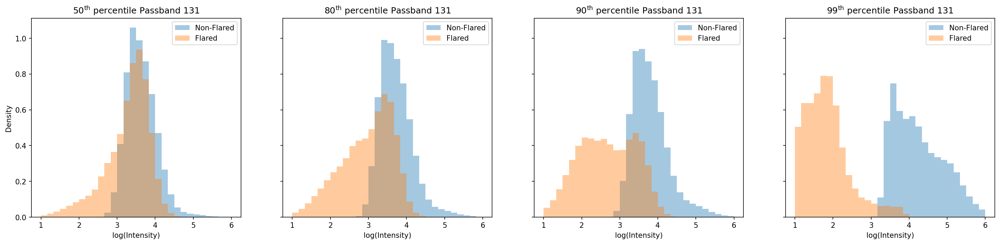

# `plot-class-dist`

**Command**
```bash
python -m src.torch.vit.plot_class_wise_distribution
```

**Dependencies**
- `data/intermediate-outs/attributions_neg.pt`
- `data/intermediate-outs/attributions_pos.pt`
- `solar_dataset.json`
- `src/torch/vit/plot_class_wise_distribution.py`
- `src/torch/vit/class_wise_distribution.py`
- `src/torch/vit/ig.py`
- `src/torch/vit/utils.py`

**Outputs**
- `plots/class_wise_int_dist_passband_131.png` _(not cached)_
- `plots/class_wise_int_dist_passband_94.png` _(not cached)_

## Output

### Class-wise Intensity Distribution Per Passband



## Notes

_Add your notes about this stage here._
