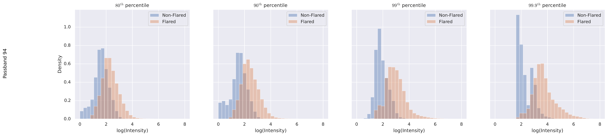
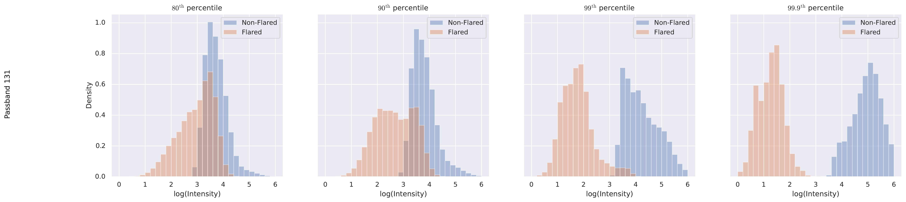
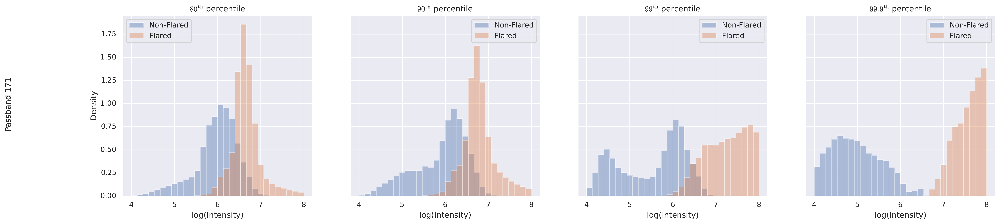
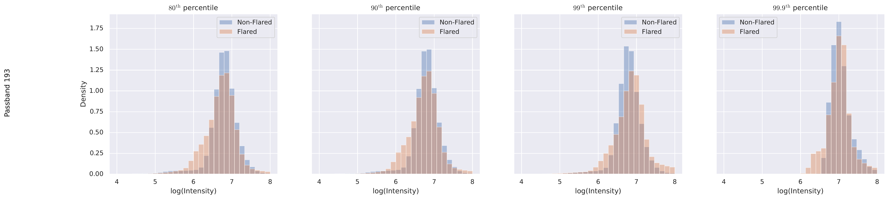
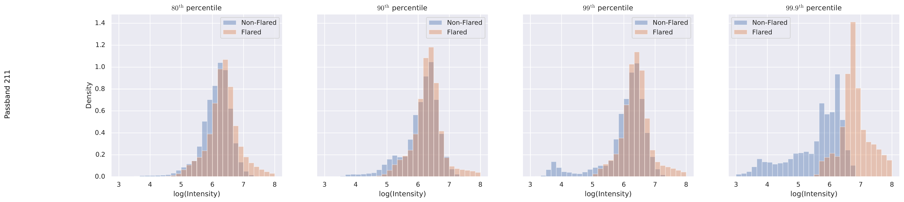
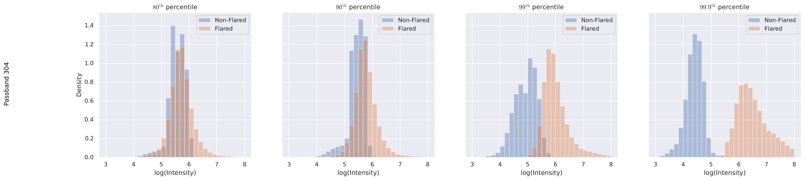
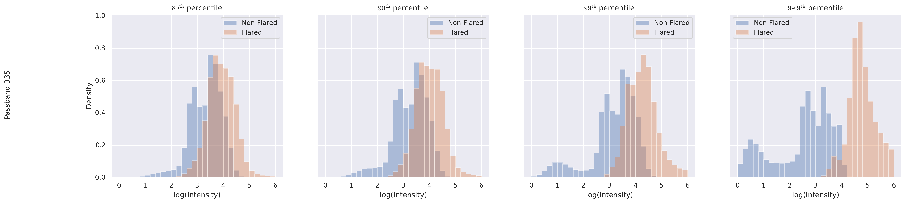

# `plot-class-dist`

**Implementation**: [View code documentation](../code/plot_class_wise_distribution.md)


**Command**
```bash
python -m src.torch.vit.plot_class_wise_distribution
```

**Dependencies**
- `data/intermediate-outs/attributions_neg.pt`
- `data/intermediate-outs/attributions_pos.pt`
- `solar_dataset.json`
- `src/torch/vit/plot_class_wise_distribution.py`
- `src/torch/vit/class_wise_distribution.py`
- `src/torch/vit/ig.py`
- `src/torch/vit/utils.py`

**Outputs**
- `plots/distribution/131.png`
- `plots/distribution/171.png`
- `plots/distribution/193.png`
- `plots/distribution/211.png`
- `plots/distribution/304.png`
- `plots/distribution/335.png`
- `plots/distribution/94.png`

## Output








## Notes

_Add your notes about this stage here._
