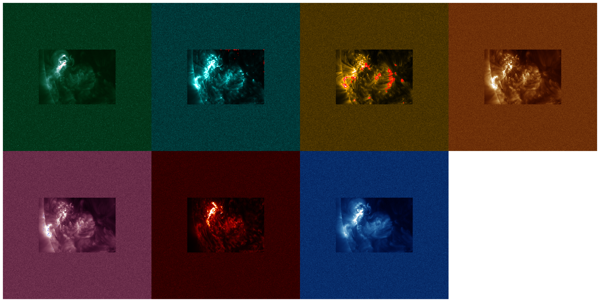

# `plot_contour_image_grid`

**Command**
```bash
python -m src.torch.vit.plot_contour_image_grid
```

**Dependencies**
- `outputs/glad-shape-197/trained_model.pth`
- `solar_dataset.json`
- `src/torch/vit/ig.py`
- `src/torch/vit/plot_contour_image_grid.py`
- `src/torch/vit/train.py`
- `src/torch/vit/utils.py`
- `stats.pkl`

**Outputs**
- `plots/attribution_contour_grid.png`

## Output

### Attribution Contour Grid


## Notes

_Add your notes about this stage here._
