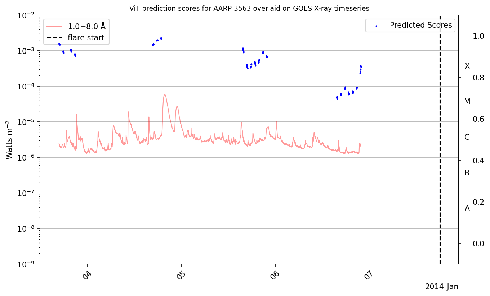

# `prediction-plots`

**Command**
```bash
python -m src.torch.vit.predictions_analyze
```

**Dependencies**
- `outputs/glad-shape-197/trained_model.pth`
- `solar_dataset.json`
- `stats.pkl`
- `src/torch/vit/ig.py`
- `src/torch/vit/predictions_analyze.py`

**Outputs**
- `pred-output/1275/goes_with_predictions.png`
- `pred-output/1449/goes_with_predictions.png`
- `pred-output/185/goes_with_predictions.png`
- `pred-output/2026/goes_with_predictions.png`
- `pred-output/3153/goes_with_predictions.png`
- `pred-output/3229/goes_with_predictions.png`
- `pred-output/3364/goes_with_predictions.png`
- `pred-output/3563/goes_with_predictions.png`
- `pred-output/377/goes_with_predictions.png`
- `pred-output/401/goes_with_predictions.png`
- `pred-output/4296/goes_with_predictions.png`
- `pred-output/4920/goes_with_predictions.png`
- `pred-output/5894/goes_with_predictions.png`
- `pred-output/833/goes_with_predictions.png`

## Output

### Prediction Plots



## Notes

_Add your notes about this stage here._
