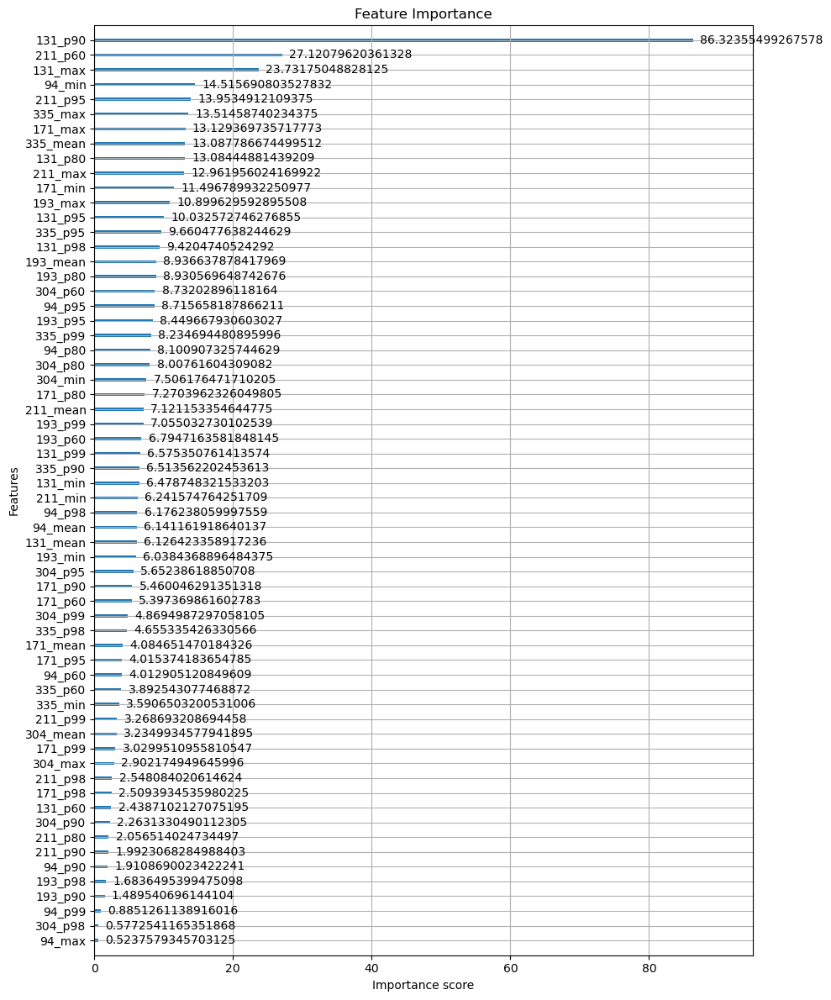
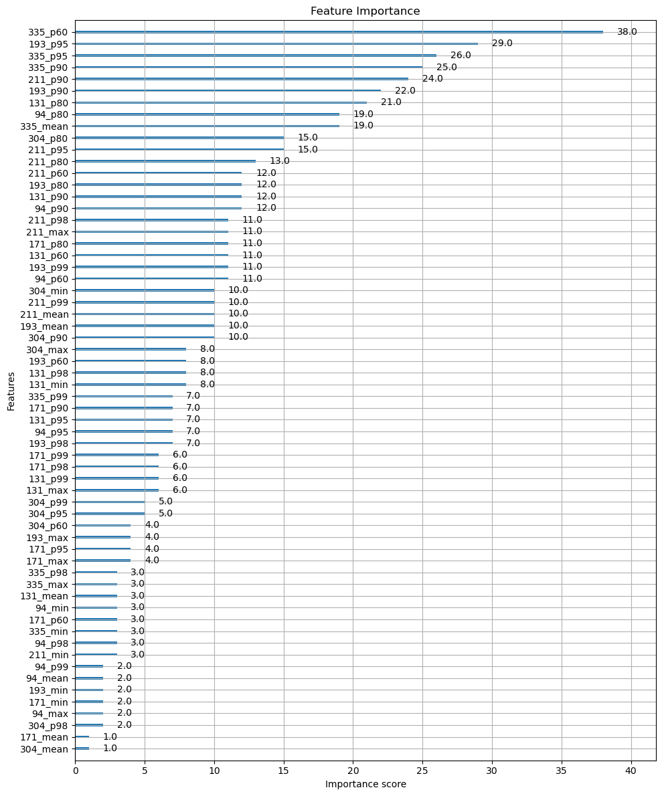

# `xgb-feat-importance`

**Implementation**: [View code documentation](../code/xgb_feat_importance.md)


**Command**
```bash
python -m src.torch.xgb_feat_importance
```

**Dependencies**
- `outputs/deep-spaceship-10/best_xgboost_model.json`
- `src/torch/xgb_feat_importance.py`

**Outputs**
- `plots/xgb_feat_importance_gain.png`
- `plots/xgb_feat_importance_weight.png`

## Output

### XGB Feature Importance (Gain)


### XGB Feature Importance (Weight)



## Notes

_Add your notes about this stage here._
